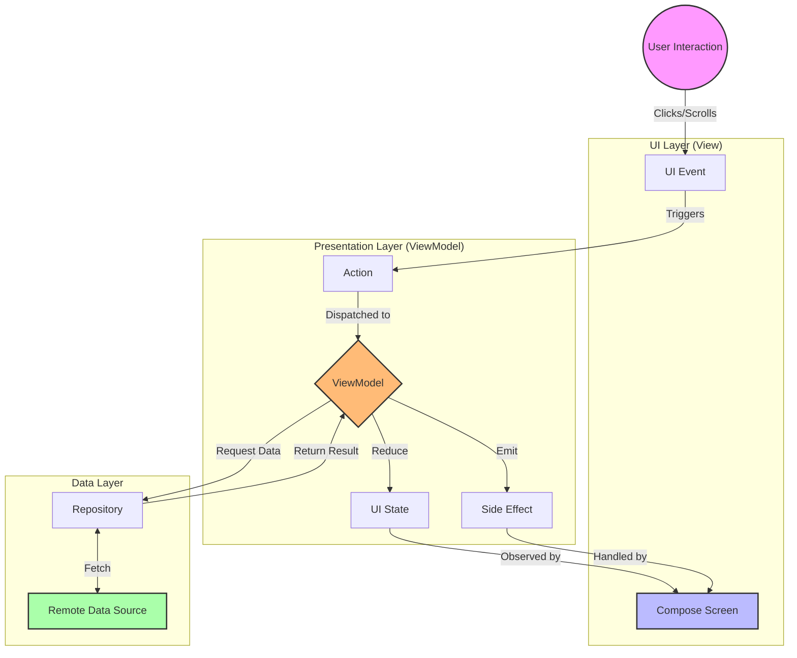

# WanAndroid Compose

<div align="center">


[](https://kotlinlang.org)
[](https://developer.android.com/jetpack/compose)
[](https://developer.android.com/topic/architecture)
[](LICENSE)

**Design for Modern Android Development. Pure Compose. Pure MVI.**

[✨ Highlights](#-highlights) • [📱 Features](#-features) • [🛠 Architecture](#-technologies--architecture) • [🚀 Get Started](#-get-started)

</div>

---

## 📖 Introduction

**WanAndroid Compose** is a modern Android application built strictly following Google's **Modern Android Development (MAD)** guide.

It serves as a best-practice showcase for **Jetpack Compose UI** and the **MVI (Model-View-Intent)** architecture. We prioritize **clean code**, **unidirectional data flow**, and **immersive user experience**.

> **"Code Less, Create More."**

---

## ✨ Highlights

<table border="0">
 <tr>
    <td width="50%">
        <h3>🎨 100% Pure Compose</h3>
        <p>Zero XML. Built entirely with Material Design 3. Features dynamic theming and fluid animations.</p>
    </td>
    <td width="50%">
        <h3>🏗️ Rigorous MVI Architecture</h3>
        <p>Strict Unidirectional Data Flow (UDF). Action driving State changes. Predictable and easy to debug.</p>
    </td>
 </tr>
 <tr>
    <td width="50%">
        <h3>⚡ Custom Skeleton Loading</h3>
        <p>Replaced heavy libraries with a lightweight, custom <code>Modifier.placeholder</code> implementation featuring a shimmer effect.</p>
    </td>
    <td width="50%">
        <h3>📱 Full-Screen Navigation</h3>
        <p>Refactored Root Navigation Host allows detail pages to be truly immersive, covering the bottom navigation bar.</p>
    </td>
 </tr>
</table>

---

## 📱 Features

| **Modern Home Feed** | **Category Filters** | **Immersive Detail** |
|:---:|:---:|:---:|
|  |  |  |
| *Adaptive Skeleton Loading* | *Sticky Header & Chip Tabs* | *Full-Screen WebView* |

### Recent Updates

-   **Custom Shimmer Placeholder**: Implemented a performant, zero-dependency skeleton loading effect in `ui/common/Placeholder.kt`.
-   **Root Navigation Refactor**: Restructured `AppMainView` to support a Root NavHost. This elevates the `DetailView` to the top level, allowing it to overlay the `MainTabs` (Scaffold + BottomBar) completely.
-   **Article Detail**: Integrated a fully functional `WebView` with progress indicators and back-press handling.

---

## 🛠 Technologies & Architecture

### Tech Stack

*   **Language**: Kotlin (Coroutines, Flow)
*   **UI**: Jetpack Compose (Material3)
*   **Navigation**: Navigation Compose (Root + Nested Graphs)
*   **Network**: Retrofit + OkHttp + Kotlinx Serialization
*   **Image**: Coil Compose

### MVI Architecture Diagram

The application follows a strict unidirectional flow:



### Navigation Hierarchy

```mermaid
graph TD
    Root[Root NavHost]
    
    subgraph "Route: Tabs"
        MainTabs[MainTabsScreen]
        Scaffold[Scaffold]
        BottomBar[Bottom Navigation]
        Home[Home Destination]
        Project[Project Destination]
        
        MainTabs --> Scaffold
        Scaffold --> BottomBar
        Scaffold --> Home
        Scaffold --> Project
    end
    
    subgraph "Route: Detail"
        Detail[DetailView]
    end
    
    Root -->|Default| MainTabs
    Root -->|Navigate: detail/{url}| Detail
    
    Home -.->|Trigger Navigation| Root
    
    style Root fill:#f96,stroke:#333
    style Detail fill:#f9f,stroke:#333
```

---

## 🚀 Get Started

1.  **Prerequisites**:
    *   Android Studio Ladybug or newer.
    *   JDK 17+.

2.  **Clone & Run**:
    ```bash
    git clone https://github.com/your-username/WanAndroidCompose.git
    cd WanAndroidCompose
    ./gradlew app:installDebug
    ```

---

<div align="center">

**WanAndroid Compose** is maintained by **sunyufeng**.

Made with ❤️ in China.

</div>
