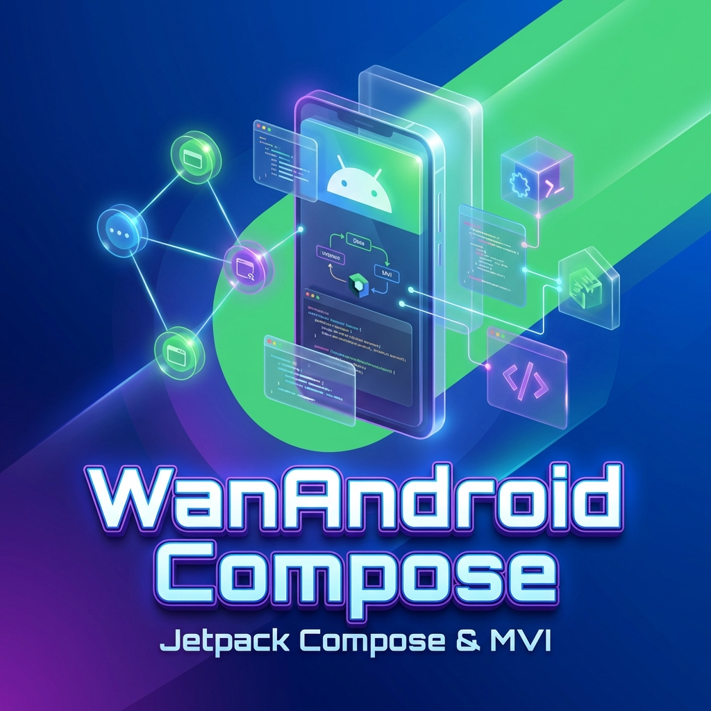
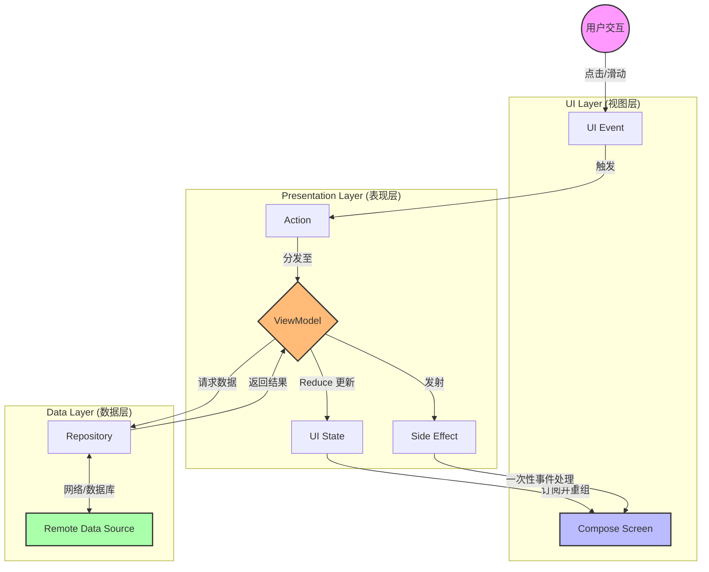

# WanAndroid Compose

<div align="center">



[](https://kotlinlang.org)
[](https://developer.android.com/jetpack/compose)
[](https://developer.android.com/topic/architecture)
[](LICENSE)

**极致体验 · 现代架构 · 纯粹 Compose**

[✨ 核心亮点](#-核心亮点) • [📱 功能预览](#-功能预览) • [🛠 技术架构](#-技术架构) • [🚀 快速开始](#-快速开始)

</div>

---

## 📖 项目简介

**WanAndroid Compose** 是一款严格遵循 Google **Modern Android Development (MAD)** 规范构建的现代化 Android 应用。

本项目致力于探索 **Jetpack Compose UI** 与 **MVI (Model-View-Intent)** 纯响应式架构的最佳实践。我们追求代码的**简洁性**、**单向数据流的可预测性**以及**极致的沉浸式体验**。

> **"Code Less, Create More."**

---

## ✨ 核心亮点

<table border="0">
 <tr>
    <td width="50%">
        <h3>🎨 100% 纯 Compose UI</h3>
        <p>彻底告别 XML。使用 Material Design 3 构建，支持动态主题、自适应布局与流畅的动画效果。</p>
    </td>
    <td width="50%">
        <h3>🏗️ 严谨的 MVI 架构</h3>
        <p>严格的单向数据流 (UDF)。Action 驱动 State 变化，逻辑清晰，易于调试和与测试。</p>
    </td>
 </tr>
 <tr>
    <td width="50%">
        <h3>⚡ 自研高性能骨架屏</h3>
        <p>移除厚重的第三方库，实现了轻量级、零依赖的 <code>Modifier.placeholder</code>，内置丝滑的 Shimmer 闪光效果。</p>
    </td>
    <td width="50%">
        <h3>📱 沉浸式全屏导航</h3>
        <p>重构的 Root NavHost 架构，使文章详情页能够完全覆盖底部导航栏，提供真正的全屏阅读体验。</p>
    </td>
 </tr>
</table>

---

## 📱 功能预览

| **首页 / 智能骨架屏** | **分类吸顶 / 切换** | **沉浸式详情页** |
|:---:|:---:|:---:|
|  |  |  |
| *自研 Shimmer 加载效果* | *Sticky Header & Chip Tabs* | *覆盖 BottomBar 的全屏体验* |

### 🔥 最新特性 (Update)

-   **自定义骨架屏 (Custom Placeholder)**:
    -   鉴于 Accompanist Placeholder 的废弃，我们在 `ui/common/Placeholder.kt` 中实现了自定义的修饰符。
    -   支持自定义高亮颜色、动画时长，性能更优。
-   **全屏导航架构 (Root Navigation)**:
    -   为了解决详情页无法全屏的问题，我们将 `AppMainView` 重构为根级导航容器。
    -   将主页面的 `Scaffold` (包含 BottomBar) 下沉至 `tabs` 路由，`detail` 路由提升至根级，实现了完美的层级覆盖。
-   **文章详情 (Detail View)**:
    -   集成了完善的 WebView，支持加载进度条、标题回传及返回键拦截处理。

---

## 🛠 技术架构

### 技术栈

*   **语言**: Kotlin (Coroutines, Flow)
*   **UI**: Jetpack Compose (Material3)
*   **导航**: Navigation Compose (支持根路由与嵌套路由)
*   **网络**: Retrofit + OkHttp + Kotlinx Serialization
*   **图片**: Coil Compose

### MVI 架构数据流

应用遵循严格的单向流动：



### 导航层级设计

为了实现全屏详情页，采用了双层导航设计：

```mermaid
graph TD
    Root[Root NavHost (AppMainView)]
    
    subgraph "Route: Tabs (主界面)"
        MainTabs[MainTabsScreen]
        Scaffold[Scaffold 骨架]
        BottomBar[Bottom Navigation]
        Home[Home Destination]
        Project[Project Destination]
        
        MainTabs --> Scaffold
        Scaffold --> BottomBar
        Scaffold --> Home
        Scaffold --> Project
    end
    
    subgraph "Route: Detail (详情页)"
        Detail[DetailView]
    end
    
    Root -->|默认路由| MainTabs
    Root -->|Navigate: detail/{url}| Detail
    
    Home -.->|调用根控制器跳转| Root
    
    style Root fill:#f96,stroke:#333
    style Detail fill:#f9f,stroke:#333
```

---

## 🚀 快速开始

1.  **环境要求**:
    *   Android Studio Ladybug 或更高版本。
    *   JDK 17+。

2.  **获取代码**:
    ```bash
    git clone https://github.com/your-username/WanAndroidCompose.git
    cd WanAndroidCompose
    ./gradlew app:installDebug
    ```

---

<div align="center">

**WanAndroid Compose** is maintained by **sunyufeng**.

Made with ❤️ in China.

</div>
